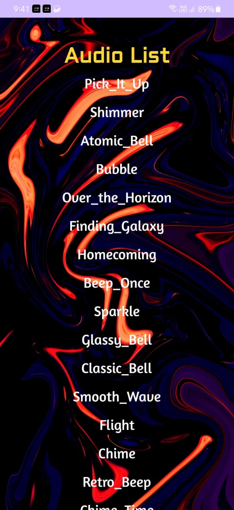
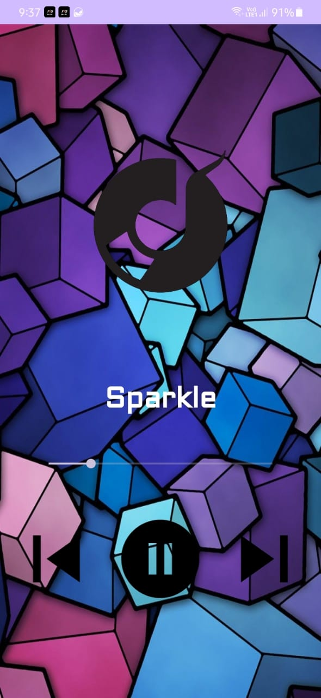

    

# Overview
An Android audio player to keep track of your audio files in your phone. (You can even find sounds that are kept hidden but are used by your OS on a daily basis).

# Download APK
<a href="https://i.loadly.io/VEg76WA1"> <i>Click here to download from Loadly.io</i></a>
##### OR
<a href="https://drive.google.com/file/d/1z5Vf2KAxcl8KPDRW-BjYBdH3MnPttc9d/view?usp=sharing"> <i>Click here to download from Google Drive</i></a>

# Screenshots
### A complete list of all your local music tracks

  
  
  

# Key Features
Find all the local tracks on your device even those hidden from you.

# Technologies used
- RecyclerView
- Adapter
- MediaStore
- MediaPlayer
